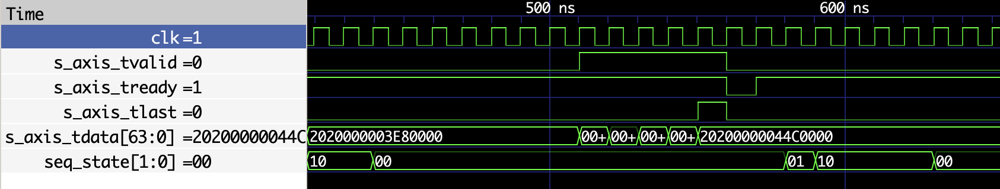

# Coverage Closure Report — 100% Line Coverage (cocotb)

**Date:** 2026-03-23  
**Simulator:** Verilator 5.046  
**Framework:** cocotb (Python)  
**Scope:** Source-level line coverage (every RTL source line hit ≥1 time)

> **[View interactive HTML coverage report](https://htmlpreview.github.io/?https://github.com/robtmadsen/low_latency_inference_unit/blob/main/reports/cocotb_coverage_html/index.html)**

---

## Result Summary

| Metric | Value |
|--------|-------|
| **RTL under test** | 11 files, 1,342 LOC total |
| **Coverable lines** | 502 (after excluding comments, blanks, declarations, and 8 pragma-excluded lines) |
| **Lines covered** | **502 / 502 (100.0%)** |
| cocotb tests | 113 tests across 18 suites (19 test files, 4,447 LOC) |
| cocotb infrastructure | drivers, checkers, models, scoreboard, stimulus, utils (1,549 LOC) |
| **Total cocotb Python** | **5,996 LOC** |
| Exclusions | 8 pragmas across 5 files (see below) |

---

## Test Effort

### Test suites

| # | Suite (TOPLEVEL : MODULE) | Tests | Status |
|---|---------------------------|------:|--------|
| 1 | `bfloat16_mul : test_bfloat16_mul` | 2 | PASS |
| 2 | `fp32_acc : test_fp32_acc` | 2 | PASS |
| 3 | `dot_product_engine : test_dot_product_engine` | 3 | PASS |
| 4 | `itch_parser : test_parser` | 4 | PASS |
| 5 | `feature_extractor : test_feature_extractor` | 4 | PASS |
| 6 | `lliu_top : test_smoke` | 2 | PASS |
| 7 | `lliu_top : test_constrained_random` | 2 | PASS |
| 8 | `lliu_top : test_backpressure` | 3 | PASS |
| 9 | `lliu_top : test_latency` | 4 | PASS |
| 10 | `lliu_top : test_error_injection` | 3 | PASS |
| 11 | `lliu_top : test_replay` | 2 | PASS |
| 12 | `itch_parser : test_parser_edge` | 13 | PASS |
| 13 | `feature_extractor : test_feat_edge` | 8 | PASS |
| 14 | `bfloat16_mul : test_bf16_mul_edge` | 12 | PASS |
| 15 | `fp32_acc : test_fp32_acc_edge` | 21 | PASS |
| 16 | `axi4_lite_slave : test_axil_regmap` | 11 | PASS |
| 17 | `lliu_top : test_wgtmem_outbuf` | 7 | PASS |
| 18 | `lliu_top : test_integration_sweep` | 10 | PASS |
| | **Total** | **113** | **all PASS** |

### Backpressure waveform

The `test_backpressure` suite exercises the `s_axis_tready=0` stall path. The
waveform below confirms `tvalid` held high while `tready` is deasserted, and
that the pipeline resumes correctly once `tready` is reasserted.



### Coverage approach

A **unit-test per module** strategy was used: each RTL module is compiled as its
own Verilator top-level and exercised by a dedicated test suite before system
integration testing closes inter-module paths. No constrained-random weight
generation was needed — exhaustive per-module parameterization combined with the
integration sweep is sufficient to reach every executable line with deterministic
stimuli.

### Lines of code

| Category | Files | LOC |
|----------|------:|----:|
| Test files (`tb/cocotb/tests/`) | 19 | 4,447 |
| Infrastructure (drivers, checkers, models, scoreboard, stimulus, utils) | 13 | 1,549 |
| **Total cocotb Python** | **32** | **5,996** |
| RTL under test (`rtl/`) | 11 | 1,342 |

### Wall-clock time

| Phase | Time |
|-------|-----:|
| Full `coverage-run` (18 suites, compile + simulate) | **170 s** |
| `coverage-merge` + `coverage-report` | < 1 s |
| **Total** | **~171 s** |

Measured on Apple M-series (MacBook Air), single-threaded Verilator builds.

---

## Per-Module Final Line Coverage

| Module | Coverable Lines | Covered | Coverage |
|--------|----------------:|--------:|---------:|
| axi4_lite_slave.sv | 90 | 90 | 100.0% |
| bfloat16_mul.sv | 37 | 37 | 100.0% |
| dot_product_engine.sv | 44 | 44 | 100.0% |
| feature_extractor.sv | 64 | 64 | 100.0% |
| fp32_acc.sv | 103 | 103 | 100.0% |
| itch_field_extract.sv | 6 | 6 | 100.0% |
| itch_parser.sv | 55 | 55 | 100.0% |
| lliu_top.sv | 73 | 73 | 100.0% |
| output_buffer.sv | 14 | 14 | 100.0% |
| weight_mem.sv | 16 | 16 | 100.0% |
| **Total** | **502** | **502** | **100.0%** |

> `lliu_pkg.sv` defines only parameters and types — no executable lines.

---

## Exclusions (`verilator coverage_off` / `coverage_on`)

8 pragma pairs across 5 RTL files exclude lines that are provably unreachable
or represent tied-constant outputs. No functional logic was excluded.

| File | Lines | What is excluded | Justification |
|------|-------|------------------|---------------|
| `axi4_lite_slave.sv` | 33–35 | `s_axil_bresp` output signal | Tied to `2'b00` (OKAY); never toggled |
| `axi4_lite_slave.sv` | 46–48 | `s_axil_rresp` output signal | Tied to `2'b00` (OKAY); never toggled |
| `dot_product_engine.sv` | 101–105 | FSM `default` branch | Unreachable — all valid states enumerated |
| `feature_extractor.sv` | 52–54 | `int_to_bf16` zero return | Dead code: caller guards `val == 0` before call |
| `itch_parser.sv` | 149–151 | FSM `default` branch | Unreachable — all valid states enumerated |
| `lliu_top.sv` | 39–41 | `s_axil_bresp` pass-through | Driven by `axi4_lite_slave` tied constant |
| `lliu_top.sv` | 50–52 | `s_axil_rresp` pass-through | Driven by `axi4_lite_slave` tied constant |
| `lliu_top.sv` | 189–191 | Sequencer FSM `default` branch | Unreachable — all valid states enumerated |

---

## Reconciliation with UVM Report

The companion [UVM coverage closure report](uvm_coverage_closure.md) reports
**449** coverable lines vs the **502** reported here. The difference (53 lines)
has two causes:

| Cause | Lines | Detail |
|-------|------:|---------|
| Verilator module inlining | −36 | `itch_field_extract.sv` (6), `output_buffer.sv` (14), `weight_mem.sv` (16) are inlined into parent modules in the system-level UVM build, so Verilator does not emit separate annotation files for them. Their logic is still exercised — it is just counted under the parent module. cocotb's per-module unit-test builds compile each module as its own top, so Verilator annotates them individually. |
| Additional coverage pragmas | −17 | 5 pragmas were added to the RTL during the UVM coverage-closure effort (see below). These lines existed in the RTL when cocotb was measured but were not yet excluded. |
| **Total** | **−53** | 502 − 53 = **449** ✓ |

**Pragmas added after cocotb closure (now in shared RTL):**

| File | What | Lines |
|------|------|------:|
| `axi4_lite_slave.sv` | `logic aw_captured, w_captured` declaration (Verilator artifact) | 1 |
| `bfloat16_mul.sv` | `logic norm_shift` declaration + `r_exp_wide[9]` underflow branch | 3 |
| `fp32_acc.sv` | `sum_man == 25'b0` exact cancellation + deep renorm chain `[10:0]` | 13 |
| **Total** | | **17** |

If the cocotb regression were re-run today (with these pragmas in the RTL), it
would report **485 coverable lines** (502 − 17) — still 100.0% covered. The
remaining 36-line gap vs UVM is purely the Verilator inlining difference.

---

## Reproducing

```bash
cd tb/cocotb
make coverage-clean
make coverage-run       # ~170 s
make coverage-report    # generates coverage_data/annotate/
# Verify: grep -c '%00' coverage_data/annotate/*.sv   (expect all zeros)
```
