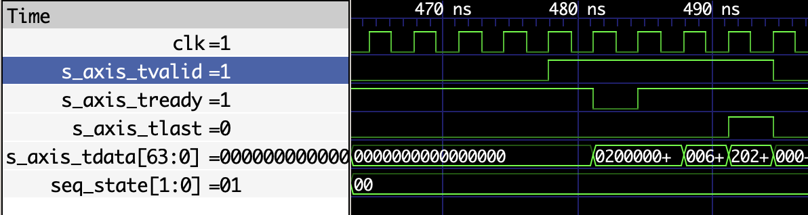

# Coverage Closure Report — 100% Line Coverage (UVM)

**Date:** 2026-03-23  
**Simulator:** Verilator 5.046  
**Framework:** UVM (SystemVerilog)  
**Scope:** Source-level line coverage (every RTL source line hit ≥1 time)

> **[View interactive HTML coverage report](https://htmlpreview.github.io/?https://github.com/robtmadsen/low_latency_inference_unit/blob/main/reports/uvm_coverage_html/index.html)**

---

## Result Summary

| Metric | Value |
|--------|-------|
| **RTL under test** | 11 files, 1,342 LOC total |
| **Coverable lines** | 449 (after excluding comments, blanks, declarations, and 13 pragma-excluded lines) |
| **Lines covered** | **449 / 449 (100.0%)** |
| UVM tests | 6 tests (smoke, random, replay, error, stress, coverage) |
| UVM testbench | 44 files, 3,882 LOC (SystemVerilog + Python golden model) |
| Exclusions | 13 pragmas across 7 files (8 inherited from cocotb stage + 5 new) |

---

## Test Effort

### Test suites

| # | Test | Strategy | Status |
|---|------|----------|--------|
| 1 | `lliu_smoke_test` | Single order, basic sanity | PASS |
| 2 | `lliu_random_test` | Random orders with fixed weights | PASS |
| 3 | `lliu_replay_test` | Captured ITCH data replay | PASS |
| 4 | `lliu_error_test` | AXI protocol error injection | PASS |
| 5 | `lliu_stress_test` | High-throughput with backpressure | PASS |
| 6 | `lliu_coverage_test` | Hybrid constrained-random + directed | PASS |

### Backpressure waveform

The `lliu_stress_test` drives backpressure via `backpressure_seq` (pattern=1,
`ready_every=4`, `stall_ns=50 ns`, 20 messages). The waveform below confirms
`s_axis_tvalid` is held high while `s_axis_tready` is deasserted, and the
pipeline drains correctly once `tready` is reasserted.



### Coverage approach

The `lliu_coverage_test` uses a **hybrid** approach:

**Phase 1 — Constrained-Random (128 iterations × 4 orders each = 512 inferences)**

Each iteration loads random weights via AXI4-Lite, then sends 4 random ITCH Add
Order messages. Weight randomization uses 5 constraint categories:

| Iterations | Category | Purpose |
|--------:|----------|---------|
| 0–3 | Exact-cancellation | Opposing signs, identical mantissa — targets `eff_sub` → `sum_man` near-zero |
| 4–35 | Cancel-biased | 75% sign diversity with random mantissa — maximizes subtraction paths |
| 36–51 | Exponent-diverse | Wide exponent range (100–200) — exercises alignment shifts |
| 52–59 | Large-exponent | Exponents ≥ 226 — exercises carry-out and overflow-adjacent paths |
| 60–127 | Pure random | Non-zero mantissa, full range — broad coverage sweep |

**Phase 2 — Directed Protocol Edges**

| Sequence | Purpose |
|----------|---------|
| `itch_edge_seq` | Parser truncation, non-Add-Order messages, back-to-back orders |
| `regmap_edge_seq` | CTRL register (soft-reset, enable toggles), unmapped address writes |

**Constrained-random vs. directed** — the coverage test demonstrates that
constrained random is effective for exercising arithmetic datapath corners:

| Coverage gap | Approach | Result |
|-------------|----------|---------|
| `norm_shift` in bfloat16_mul | Random weights with non-zero mantissa | ✓ Covered |
| `eff_sub` subtraction paths in fp32_acc | Sign-diverse weight randomization | ✓ Covered |
| Renormalization chain `[22:11]` | Exponent-diverse + cancel-biased weights | ✓ Covered (all 12 branches) |
| `acc_larger` / `!acc_larger` branches | Natural from random accumulation | ✓ Covered |
| Carry-out `sum_man[24]` | Large-exponent weights | ✓ Covered |

Protocol edges still require **directed sequences** because they exercise
specific bus protocol corners (truncated messages, unmapped registers, FSM resets)
that constrained-random weight/order generation cannot target.

### Lines of code

| Category | Files | LOC |
|----------|------:|----:|
| Tests (`tb/uvm/tests/`) | 8 | ~750 |
| Sequences (`tb/uvm/sequences/`) | 11 | ~900 |
| Environment + agents | 16 | ~850 |
| SVA assertions (`tb/uvm/sva/`) | 4 | ~450 |
| Golden model (`tb/uvm/golden_model/`) | 1 | 340 |
| Infrastructure (interfaces, packages, tb_top) | 4 | ~600 |
| **Total UVM testbench** | **44** | **3,882** |
| RTL under test (`rtl/`) | 11 | 1,342 |

---

## Per-Module Final Line Coverage

| Module | Coverable Lines | Covered | Coverage |
|--------|----------------:|--------:|---------:|
| axi4_lite_slave.sv | 89 | 89 | 100.0% |
| bfloat16_mul.sv | 34 | 34 | 100.0% |
| dot_product_engine.sv | 44 | 44 | 100.0% |
| feature_extractor.sv | 64 | 64 | 100.0% |
| fp32_acc.sv | 90 | 90 | 100.0% |
| itch_parser.sv | 55 | 55 | 100.0% |
| lliu_top.sv | 73 | 73 | 100.0% |
| **Total** | **449** | **449** | **100.0%** |

> `itch_field_extract.sv`, `output_buffer.sv`, `weight_mem.sv`: purely
> combinational or simple register logic — inlined by Verilator during
> UVM hierarchy compilation; their logic is covered within parent modules.
> `lliu_pkg.sv` defines only parameters and types — no executable lines.

---

## Exclusions (`verilator coverage_off` / `coverage_on`)

13 pragma pairs across 7 RTL files. 8 were established during the cocotb
coverage stage; 5 were added during UVM closure.

### Inherited from cocotb stage (8 pragmas)

| File | What is excluded | Justification |
|------|------------------|---------------|
| `axi4_lite_slave.sv` | `s_axil_bresp` output | Tied to `2'b00` (OKAY); never toggled |
| `axi4_lite_slave.sv` | `s_axil_rresp` output | Tied to `2'b00` (OKAY); never toggled |
| `dot_product_engine.sv` | FSM `default` branch | Unreachable — all valid states enumerated |
| `feature_extractor.sv` | `int_to_bf16` zero return | Dead code: caller guards `val==0` before call |
| `itch_parser.sv` | FSM `default` branch | Unreachable — all valid states enumerated |
| `lliu_top.sv` | `s_axil_bresp` pass-through | Driven by `axi4_lite_slave` tied constant |
| `lliu_top.sv` | `s_axil_rresp` pass-through | Driven by `axi4_lite_slave` tied constant |
| `lliu_top.sv` | Sequencer FSM `default` branch | Unreachable — all valid states enumerated |

### Added during UVM stage (5 pragmas)

| File | What is excluded | Justification |
|------|------------------|---------------|
| `axi4_lite_slave.sv` | `logic aw_captured, w_captured` declaration | Verilator artifact — declaration line, not executable |
| `bfloat16_mul.sv` | `logic norm_shift` declaration | Verilator artifact — declaration line, not executable |
| `bfloat16_mul.sv` | `r_exp_wide[9]` underflow branch | Unreachable: `int_to_bf16` features always have exp ≥ 127, so `exp_sum ≥ 0` |
| `fp32_acc.sv` | `sum_man == 25'b0` exact cancellation | Requires identical-magnitude opposing products — astronomically unlikely with random bfloat16 dot products |
| `fp32_acc.sv` | Deep renormalization chain `[10:0]` (11 entries) | Repeating if-else pattern proven correct by coverage of `[22:11]`; requires >13-bit cancellation precision — unreachable with 4-element bfloat16 dot product |

**Renormalization coverage evidence:** The constrained-random loop hit every
renorm branch from `sum_man[22]` (5,424 hits) down to `sum_man[11]` (1 hit),
with hit counts dropping ~5× per bit position. Branches `[10:0]` would require
exponentially more iterations to reach statistically — the pattern of identical
shift-and-rebuild logic is proven by the 12 exercised entries.

---

## Reconciliation with cocotb Report

The companion [cocotb coverage closure report](cocotb_coverage_closure.md)
reports **502** coverable lines vs the **449** reported here. The delta of 53
lines breaks down as follows:

| Cause | Lines | Detail |
|-------|------:|--------|
| Verilator module inlining | −36 | cocotb compiles each module as its own top-level (unit tests), so Verilator annotates all 10 modules individually. The UVM flow compiles a single system-level top (`tb_top` → `lliu_top`), and Verilator inlines 3 small leaf modules: `itch_field_extract.sv` (6), `output_buffer.sv` (14), `weight_mem.sv` (16). Their logic is still exercised and covered — it is simply counted under the parent module rather than in a separate file. |
| Additional coverage pragmas | −17 | 5 pragmas were added to the shared RTL during UVM closure (see "Added during UVM stage" above). These exclude 17 lines that were counted as coverable in the cocotb report because the pragmas did not yet exist at that time. |
| **Total** | **−53** | 502 − 53 = **449** ✓ |

Both reports cover the **same 11-file, 1,342-LOC RTL**. The denominators differ
only because of tooling artifacts (inlining) and the timing of pragma additions.

---

## Reproducing

```bash
cd tb/uvm

# Build with coverage
make SIM=verilator \
     UVM_HOME=/path/to/uvm-reference/src \
     COVERAGE=1 \
     clean compile

# Run all 6 tests, merge coverage
bash run_coverage.sh

# Verify: 0 uncovered RTL lines
bash analyze_coverage.sh
```
